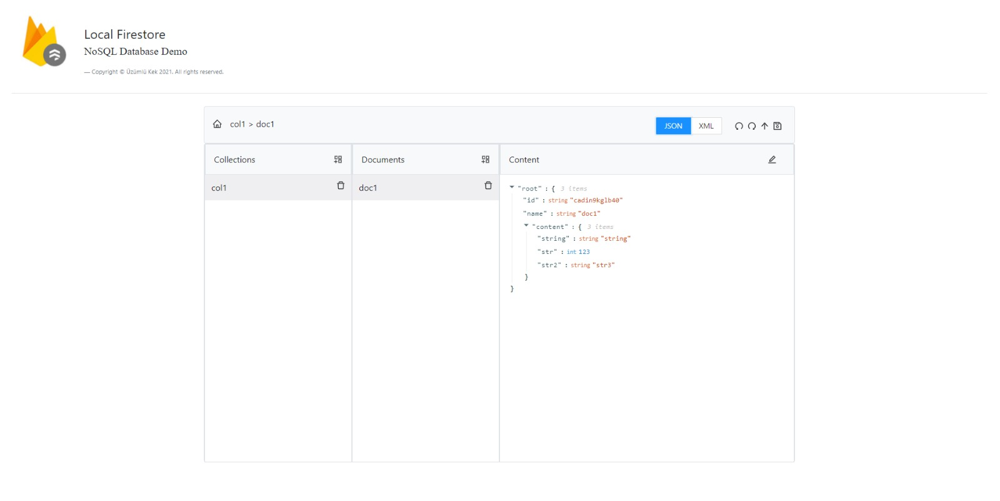
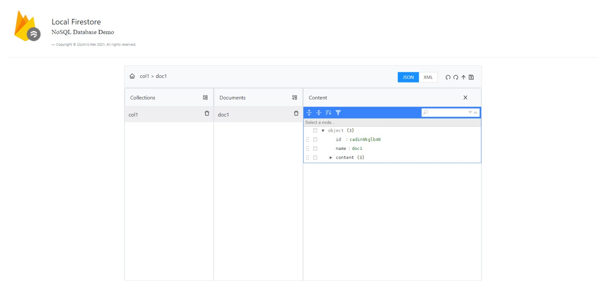
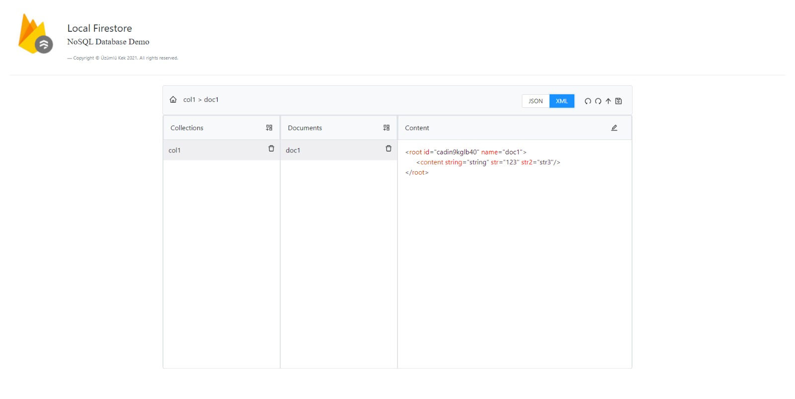

<b>You can download image of this project in the below link. </b>  

Image: https://hub.docker.com/r/uzumlukek/local-firestore  

<b> You can clone the repository and up the project. </b>  

git clone https://github.com/muhammedsaidkaya/react-nosql-database-demo.git  
cd react-nosql-database-demo  
docker-compose up --build  

<b> You can make a demo of project on AWS EC2 Instance </b>  

Live: http://load-balancer-said-1025287615.eu-central-1.elb.amazonaws.com/  

<b>  The project deployed the instance by following script. </b>  

#!/bin/bash -ex  
curl -fsSL https://get.docker.com -o get-docker.sh  
sh get-docker.sh  
sudo usermod -aG docker $(whoami)  
sudo docker container run -p 80:3000 -d uzumlukek/local-firestore:testing  

<b> You can see the images of project. </b>  

